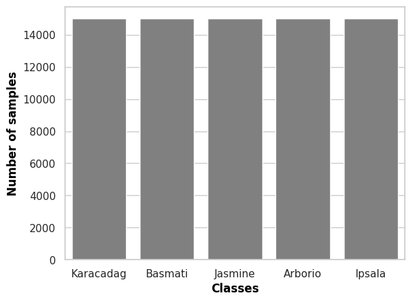
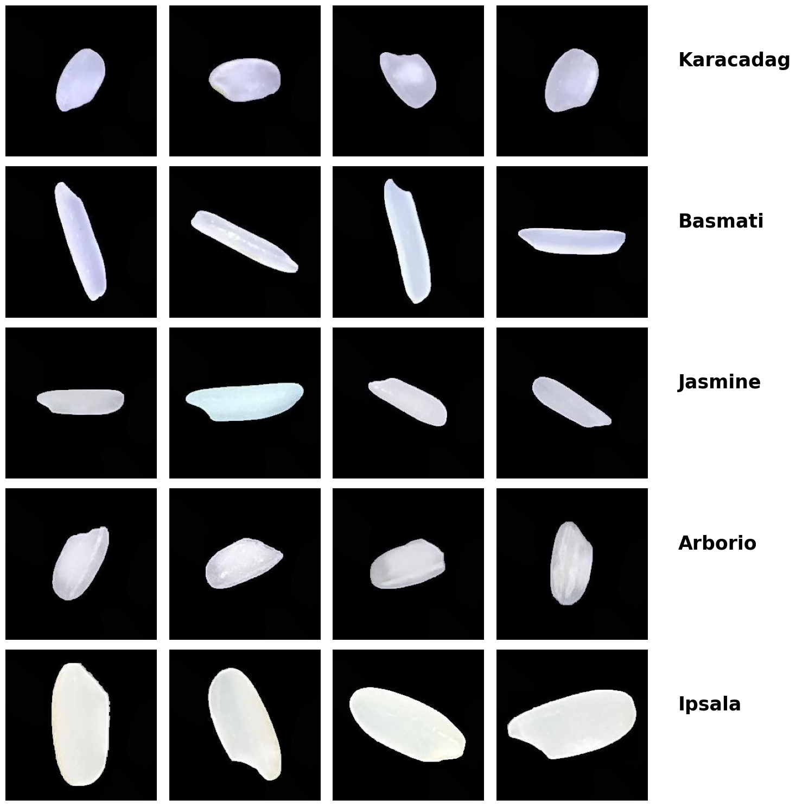

# Rice Image Classification using Deep Learning

This repository contains a Tensorflow implementation of a Convolutional Neural Network (CNN) model for classifying different varieties of rice grains based on their images. The model is trained on the Rice Image Dataset, which consists of images of five different rice varieties: Arborio, Basmati, Ipsala, Jasmine, and Karacadag.

## Dataset

The Rice Image Dataset used in this project is available on Kaggle. It can be downloaded from the following link:

https://www.kaggle.com/datasets/dollarzerobidsl/rice-image-dataset

The dataset contains a total of 5,947 images of rice grains, categorized into five different classes. The images are stored in separate folders for each class.

## Requirements

To run this project, you need to have the following dependencies installed:

- Tensorflow
- Keras
- NumPy
- Pandas
- Matplotlib
- Seaborn
- splitfolders

## Usage

1. Clone this repository to your local machine.
2. Download the Rice Image Dataset from the provided Kaggle link and extract it to a suitable location.
3. Update the `df_path` variable in the code to point to the location of the extracted dataset.
4. Run the script, and it will preprocess the data, split it into training, validation, and test sets, and train the CNN model.
5. The trained model will be saved as `CNN_Model.h5` in the current working directory.

