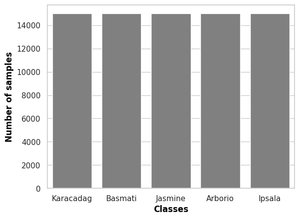
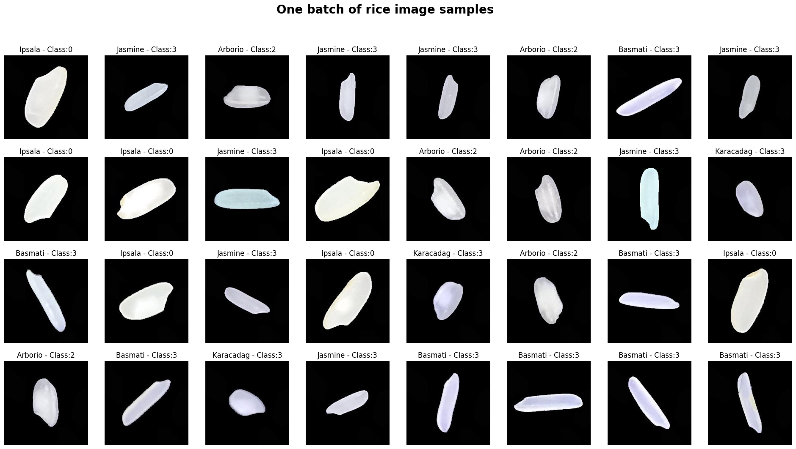
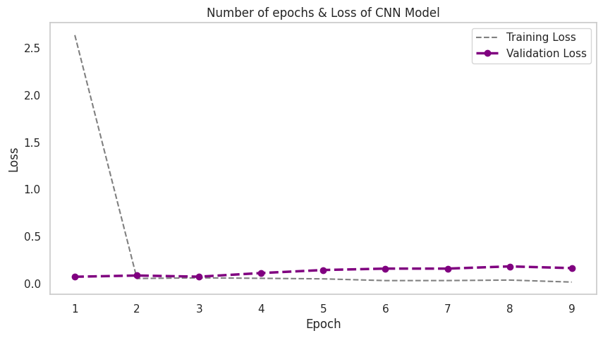
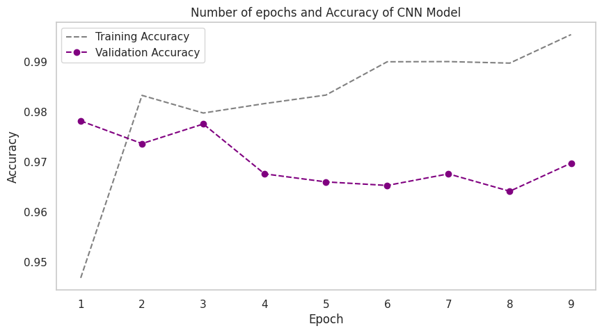
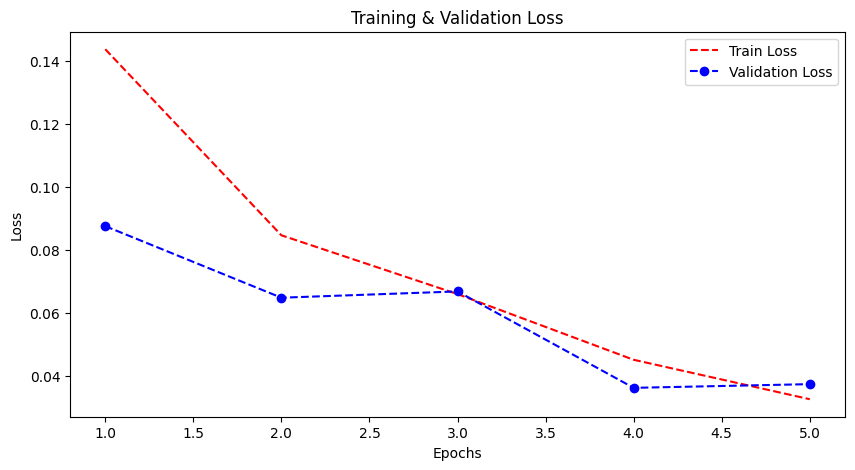
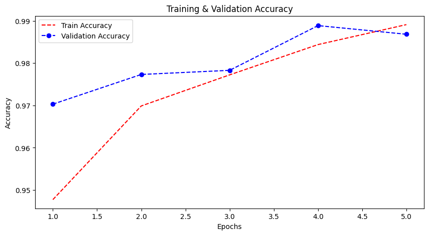
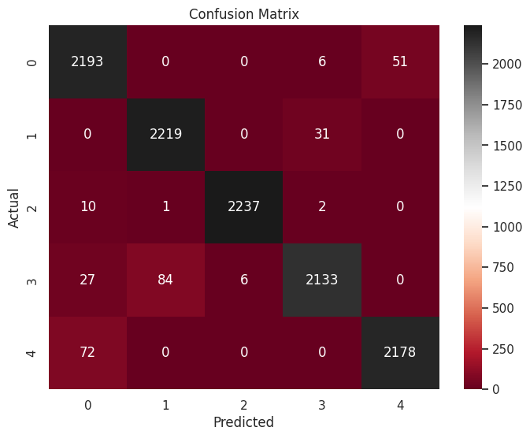
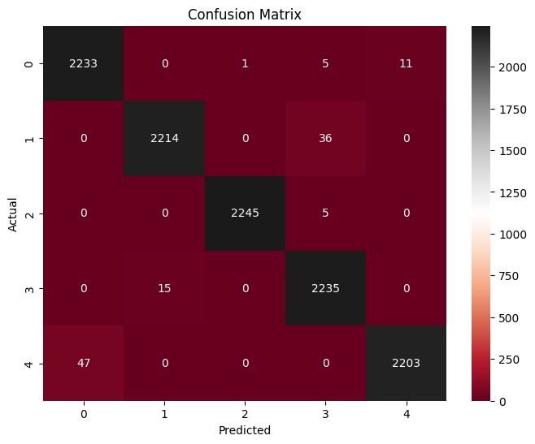

# Rice Image Classification using Deep Learning

This repository contains Tensorflow and Pytorch implementation of a Convolutional Neural Network (CNN) model for classifying different varieties of rice grains based on their images. The model is trained on the [Rice Image Dataset](https://www.kaggle.com/datasets/muratkokludataset/rice-image-dataset), which consists of images of five different rice varieties: Arborio, Basmati, Ipsala, Jasmine, and Karacadag.
> [!NOTE]
> My codes are running on my [Kaggel](https://www.kaggle.com/ahmadpour79) account using GPU P100.

## Abstract

Rice, which is among the most widely produced grain products worldwide, has many genetic varieties. These varieties are separated from each other due to some of their features. These are usually features such as texture, shape, and color. With these features that distinguish rice varieties, it is possible to classify and evaluate the quality of seeds. This repository used Arborio, Basmati, Ipsala, Jasmine and Karacadag, which are five different varieties of rice often grown in Turkey. A total of 75,000 grain images, 15,000 from each of these varieties, are included in the dataset. A second dataset with 106 features including 12 morphological, 4 shape and 90 color features obtained from these images was used. Models were created using the Convolutional Neural Network (CNN) with Pytorch and Tesnorflow libraries for building same CNN architecture. Classification successes from the models were achieved as ***98% with Tensorflow and 99% with Pytorch***.

## Dataset
The dataset contains a total of 5,947 images of rice grains, categorized into five different classes. The images are stored in separate folders for each class.
```python
sns.set(style="whitegrid", palette="pastel")
ax = sns.countplot(x=df.label, color="gray")
ax.set_xlabel("Classes", fontdict={'weight': 'bold'})
ax.xaxis.label.set_color('black')
ax.set_ylabel("Number of samples", fontdict={'weight': 'bold'})
ax.yaxis.label.set_color('black')
plt.show()
```
Output:
[](#)

## Ready dataset
Using [split-folders](https://pypi.org/project/split-folders/) library, create a new folder that contains the `train`, `test`, and `val` (validation) subsets. The dataset will be split as follows: _70% for training, 15% for testing, and 15% for validation_.
```python
splitfolders.ratio(path, output='df_splitted', seed=42, ratio=(0.7, 0.15, 0.15))
```
Resize images to (250, 250) and normalize pixel values to the range [0, 1], and set the batch size to 32.
> Tensorflow
```python
BATCH_SIZE = 32
IMAGE_SIZE = (250, 250)
Train = keras.utils.image_dataset_from_directory(
    directory='/kaggle/working/df_splitted/train',
    labels='inferred',
    label_mode='categorical',
    batch_size= BATCH_SIZE,
    image_size= IMAGE_SIZE,
    seed= 42
)
Test = keras.utils.image_dataset_from_directory(
    directory= '/kaggle/working/df_splitted/test',
    labels='inferred',
    label_mode= 'categorical',
    batch_size= BATCH_SIZE,
    image_size= IMAGE_SIZE,
    seed= 42
)
Validation = keras.utils.image_dataset_from_directory(
    directory= '/kaggle/working/df_splitted/val',
    labels= 'inferred',
    label_mode= 'categorical',
    batch_size= BATCH_SIZE,
    image_size= IMAGE_SIZE,
    seed= 42
)
```
Output:
```
Found 52500 files belonging to 5 classes.
Found 11250 files belonging to 5 classes.
Found 11250 files belonging to 5 classes.
```
> Pytorch
```python
Train = datasets.ImageFolder(os.path.join(dir, 'train'), transform = transformations)
train_loader = DataLoader(Train, batch_size=32, shuffle=True)
print(f'Train:\n {Train}\n\n')

Test = datasets.ImageFolder(os.path.join(dir, 'test'), transform = transformations)
test_loader = DataLoader(Test, batch_size=32, shuffle=True)
print(f'Test:\n {Test}\n\n')

Validation = datasets.ImageFolder(os.path.join(dir, 'val'), transform = transformations)
validation_loader = DataLoader(Validation, batch_size=32, shuffle=True)
print(f'Validation:\n {Validation}\n\n')
```
Output:
```
Train:
 Dataset ImageFolder
    Number of datapoints: 52500
    Root location: /kaggle/working/df_splitted/train
    StandardTransform
Transform: Compose(
               ToTensor()
               Normalize(mean=0, std=1)
               Resize(size=(250, 250), interpolation=bilinear, max_size=None, antialias=warn)
           )


Test:
 Dataset ImageFolder
    Number of datapoints: 11250
    Root location: /kaggle/working/df_splitted/test
    StandardTransform
Transform: Compose(
               ToTensor()
               Normalize(mean=0, std=1)
               Resize(size=(250, 250), interpolation=bilinear, max_size=None, antialias=warn)
           )


Validation:
 Dataset ImageFolder
    Number of datapoints: 11250
    Root location: /kaggle/working/df_splitted/val
    StandardTransform
Transform: Compose(
               ToTensor()
               Normalize(mean=0, std=1)
               Resize(size=(250, 250), interpolation=bilinear, max_size=None, antialias=warn)
           )
```
```python
imgs, labels = next(iter(train_loader))
default_labels = {
    0: "Arborio",
    1: "Basmati",
    2: "Ipsala",
    3: "Jasmine",
    4: "Karacadag",
}
img_names = ['image_{}'.format(i) for i in range(len(imgs))]

fig, axes = plt.subplots(4, 8, figsize=(24, 12))
fig.suptitle('One batch of rice image samples', fontsize=20, fontweight='bold')

for ax, img, label_idx, img_name in zip(axes.flatten(), imgs, labels, img_names):
    img = torch.permute(img, (1, 2, 0))
    ax.imshow(img)
    ax.set_title(f'{default_labels[int(label_idx)]} - Class:{labels[int(label_idx)]}') 
    ax.axis('off')

plt.show()
```
Output:
[](#)

## Model
My CNN model takes images of size 250x250 with 3 color channels (RGB) as input. It begins with a convolutional layer with 6 filters of size 3x3, followed by a ReLU activation function and a 2x2 max pooling layer to reduce the spatial dimensions. This is followed by a second convolutional layer with 16 filters of size 3x3, another ReLU activation function, and another 2x2 max pooling layer. The output is then flattened into a 1D tensor, which is fed into fully connected layers with 120 and 84 neurons respectively, both using ReLU activation. Finally, the output layer with 5 neurons and a softmax activation function produces probability distributions for each of the 5 classes. The model is compiled using the Adam optimizer and the categorical cross-entropy loss function, and it is evaluated based on accuracy. The architecture consists of two main parts: convolutional layers and dense (fully connected) layers. The convolutional part includes two convolutional layers with ReLU activations and max pooling, which extract features from the input images and reduce their spatial dimensions. The dense part contains three fully connected layers with ReLU activations, which process the flattened feature maps from the convolutional layers and map them to the final output layer representing class scores. The architecture starts with an input image, passes through the convolutional layers for feature extraction, flattens the output, and then uses the fully connected layers to perform classification, producing logits for each class.
>Tensorflow
```python
INPUT_SHAPE = (250, 250, 3)

cnn = Sequential()

cnn.add(Conv2D(6, (3, 3), activation='relu', input_shape=INPUT_SHAPE))
cnn.add(MaxPooling2D((2, 2)))
cnn.add(Conv2D(16, (3, 3), activation='relu'))
cnn.add(MaxPooling2D((2, 2)))
cnn.add(Flatten())
cnn.add(Dense(120, activation='relu'))
cnn.add(Dense(84, activation='relu'))
cnn.add(Dense(5, activation='softmax'))
```
>Pytorch
```python
class CNN(nn.Module):
    def __init__(self, In_channels, Num_classes):
        super(CNN, self).__init__()

        self.cnn_layers = nn.Sequential(
            nn.Conv2d(in_channels=In_channels, out_channels=6, kernel_size=3),
            nn.ReLU(),
            nn.MaxPool2d(kernel_size=(2, 2)),
            nn.Conv2d(in_channels=6, out_channels=16, kernel_size=3),
            nn.ReLU(),
            nn.MaxPool2d(kernel_size=(2, 2)),
        )

        self.dense_layers = nn.Sequential(
            nn.Linear(59536, 120),
            nn.ReLU(),
            nn.Linear(120, 84),
            nn.ReLU(),
            nn.Linear(84, Num_classes)
        )

    def forward(self, x):
        op = self.cnn_layers(x)
        op = torch.flatten(op, 1)
        op = self.dense_layers(op)
        return op
```
Output:
<pre style="white-space:pre;overflow-x:auto;line-height:normal;font-family:Menlo,'DejaVu Sans Mono',consolas,'Courier New',monospace">┏━━━━━━━━━━━━━━━━━━━━━━━━━━━━━━━━━┳━━━━━━━━━━━━━━━━━━━━━━━━┳━━━━━━━━━━━━━━━┓
┃<span style="font-weight: bold"> Layer (type)                    </span>┃<span style="font-weight: bold"> Output Shape           </span>┃<span style="font-weight: bold">       Param # </span>┃
┡━━━━━━━━━━━━━━━━━━━━━━━━━━━━━━━━━╇━━━━━━━━━━━━━━━━━━━━━━━━╇━━━━━━━━━━━━━━━┩
│ conv2d_1 (<span style="color: #0087ff; text-decoration-color: #0087ff">Conv2D</span>)               │ (<span style="color: #00d7ff; text-decoration-color: #00d7ff">None</span>, <span style="color: #00af00; text-decoration-color: #00af00">248</span>, <span style="color: #00af00; text-decoration-color: #00af00">248</span>, <span style="color: #00af00; text-decoration-color: #00af00">6</span>)    │           <span style="color: #00af00; text-decoration-color: #00af00">168</span> │
├─────────────────────────────────┼────────────────────────┼───────────────┤
│ max_pooling2d (<span style="color: #0087ff; text-decoration-color: #0087ff">MaxPooling2D</span>)    │ (<span style="color: #00d7ff; text-decoration-color: #00d7ff">None</span>, <span style="color: #00af00; text-decoration-color: #00af00">124</span>, <span style="color: #00af00; text-decoration-color: #00af00">124</span>, <span style="color: #00af00; text-decoration-color: #00af00">6</span>)    │             <span style="color: #00af00; text-decoration-color: #00af00">0</span> │
├─────────────────────────────────┼────────────────────────┼───────────────┤
│ conv2d_2 (<span style="color: #0087ff; text-decoration-color: #0087ff">Conv2D</span>)               │ (<span style="color: #00d7ff; text-decoration-color: #00d7ff">None</span>, <span style="color: #00af00; text-decoration-color: #00af00">122</span>, <span style="color: #00af00; text-decoration-color: #00af00">122</span>, <span style="color: #00af00; text-decoration-color: #00af00">16</span>)   │           <span style="color: #00af00; text-decoration-color: #00af00">880</span> │
├─────────────────────────────────┼────────────────────────┼───────────────┤
│ max_pooling2d_1 (<span style="color: #0087ff; text-decoration-color: #0087ff">MaxPooling2D</span>)  │ (<span style="color: #00d7ff; text-decoration-color: #00d7ff">None</span>, <span style="color: #00af00; text-decoration-color: #00af00">61</span>, <span style="color: #00af00; text-decoration-color: #00af00">61</span>, <span style="color: #00af00; text-decoration-color: #00af00">16</span>)     │             <span style="color: #00af00; text-decoration-color: #00af00">0</span> │
├─────────────────────────────────┼────────────────────────┼───────────────┤
│ flatten (<span style="color: #0087ff; text-decoration-color: #0087ff">Flatten</span>)               │ (<span style="color: #00d7ff; text-decoration-color: #00d7ff">None</span>, <span style="color: #00af00; text-decoration-color: #00af00">59536</span>)          │             <span style="color: #00af00; text-decoration-color: #00af00">0</span> │
├─────────────────────────────────┼────────────────────────┼───────────────┤
│ dense (<span style="color: #0087ff; text-decoration-color: #0087ff">Dense</span>)                   │ (<span style="color: #00d7ff; text-decoration-color: #00d7ff">None</span>, <span style="color: #00af00; text-decoration-color: #00af00">120</span>)            │     <span style="color: #00af00; text-decoration-color: #00af00">7,144,440</span> │
├─────────────────────────────────┼────────────────────────┼───────────────┤
│ dense_1 (<span style="color: #0087ff; text-decoration-color: #0087ff">Dense</span>)                 │ (<span style="color: #00d7ff; text-decoration-color: #00d7ff">None</span>, <span style="color: #00af00; text-decoration-color: #00af00">84</span>)             │        <span style="color: #00af00; text-decoration-color: #00af00">10,164</span> │
├─────────────────────────────────┼────────────────────────┼───────────────┤
│ dense_2 (<span style="color: #0087ff; text-decoration-color: #0087ff">Dense</span>)                 │ (<span style="color: #00d7ff; text-decoration-color: #00d7ff">None</span>, <span style="color: #00af00; text-decoration-color: #00af00">5</span>)              │           <span style="color: #00af00; text-decoration-color: #00af00">425</span> │
└─────────────────────────────────┴────────────────────────┴───────────────┘
</pre>

## Train model
>Tensorflow
```python
fig, ax = plt.subplots(figsize=(10, 5))

ax.plot(epoch_count, training_loss, 'r--', color='gray', label='Training Loss')
ax.plot(epoch_count, val_loss, '--bo', color='purple', linewidth=2.5, label='Validation Loss')
ax.legend()
ax.set_title('Number of epochs & Loss of CNN Model')
ax.set_xlabel('Epoch')
ax.set_ylabel('Loss')
ax.set_xticks(np.arange(1, 10))
ax.grid(False)
plt.show()
```
Output:
[](#)
```python
fig, ax = plt.subplots(figsize=(10, 5))
ax.plot(epoch_count, training_acc, 'r--', color='gray', label='Training Accuracy')
ax.plot(epoch_count, val_acc, '--bo', color='purple', label='Validation Accuracy')
ax.legend()
ax.set_title('Number of epochs and Accuracy of CNN Model')
ax.set_xlabel('Epoch')
ax.set_ylabel('Accuracy')
ax.set_xticks(np.arange(1, 10))
ax.grid(False)
plt.show()
```
Output:
[](#)

>Pytorch
```python
plt.figure(figsize=(10, 5))
plt.plot(range(1, num_epochs+1), train_losses, 'r--', label='Train Loss')
plt.plot(range(1, num_epochs+1), val_losses, '--bo', label='Validation Loss')
plt.xlabel('Epochs')
plt.ylabel('Loss')
plt.title('Training & Validation Loss')
plt.legend()
plt.show()
```
Output:
[](#)
```python
plt.figure(figsize=(10, 5))
plt.plot(range(1, num_epochs+1), train_accs, 'r--', label='Train Accuracy')
plt.plot(range(1, num_epochs+1), val_accs, '--bo',  label='Validation Accuracy')
plt.xlabel('Epochs')
plt.ylabel('Accuracy')
plt.title('Training & Validation Accuracy')
plt.legend()
plt.show()
```
Output:
[](#)

## Evaluate model
>Tensorflow
```python
test_loss, test_acc = last_model.evaluate(Test)
print(f'\nTest accuracy:{test_acc:.5f}\ntest_loss: {test_loss:.5f}')
```
Output:
```
352/352 ━━━━━━━━━━━━━━━━━━━━ 5s 13ms/step - accuracy: 0.9728 - loss: 0.1273

Test accuracy:0.97422
test_loss: 0.12918
```
>Pytorch
```python
with torch.no_grad() :
    model.eval()
    test_loss = []
    correct_test = 0
    total_test = 0

    for images, labels in new_test_dataloader :

        outputs = model(images)
        loss = criterion(outputs, labels)
        test_loss.append(loss.item())

        _, prediction = torch.max(outputs, 1)
        total_test += labels.size(0)
        correct_test += (prediction==labels).sum().item()
        
    test_loss = np.mean(test_loss)
    test_acc = correct_test / total_test
    
    print(f'Test loss: {test_loss:.4f}\nTest Accuracy: {test_acc:.4f}')
```
Output:
```
Test loss: 0.0336
Test Accuracy: 0.9893
```
### Confussion matrix
>Tensorflow
```python
predictions = []
true_labels = []
class_names = [
    "Arborio",
    "Basmati",
    "Ipsala",
    "Jasmine",
    "Karacadag"
    ]
for batch in Test:
    images, labels = batch
    batch_predictions = cnn.predict(images, verbose=0)
    predictions.extend(np.argmax(batch_predictions, axis=1))
    true_labels.extend(np.argmax(labels, axis=1))
predictions = np.array(predictions)
true_labels = np.array(true_labels)
conf_matrix = confusion_matrix(true_labels, predictions)
plt.figure(figsize=(8, 6))
sns.heatmap(conf_matrix, annot=True, fmt='d', cmap='RdGy')
plt.ylabel('Actual')
plt.xlabel('Predicted')
plt.title('Confusion Matrix')
plt.show()
class_report = classification_report(true_labels, predictions, target_names=class_names)
print("\nClassification Report:\n", class_report)
```
Output:
[](#)
```
Classification Report:
               precision    recall  f1-score   support

     Arborio       0.95      0.97      0.96      2250
     Basmati       0.96      0.99      0.97      2250
      Ipsala       1.00      0.99      1.00      2250
     Jasmine       0.98      0.95      0.96      2250
   Karacadag       0.98      0.97      0.97      2250

    accuracy                           0.97     11250
   macro avg       0.97      0.97      0.97     11250
weighted avg       0.97      0.97      0.97     11250

```
>Pytorch
```python
model.eval()
all_preds = []
all_labels = []
with torch.no_grad():
    for inputs, labels in new_test_dataloader:
        outputs = model(inputs)
        _, preds = torch.max(outputs, 1)

        all_preds.extend(preds.cpu().numpy())
        all_labels.extend(labels.cpu().numpy())

cm = confusion_matrix(all_labels, all_preds)
plt.figure(figsize=(8, 6))
sns.heatmap(cm, annot=True, fmt='d', cmap='RdGy')
plt.xlabel('Predicted')
plt.ylabel('Actual')
plt.title('Confusion Matrix')
plt.show()
report = classification_report(all_labels, all_preds, target_names=Test.classes)
print("Classification Report:\n", report)
```
Output:
[](#)
```
Classification Report:
               precision    recall  f1-score   support

     Arborio       0.98      0.99      0.99      2250
     Basmati       0.99      0.98      0.99      2250
      Ipsala       1.00      1.00      1.00      2250
     Jasmine       0.98      0.99      0.99      2250
   Karacadag       1.00      0.98      0.99      2250

    accuracy                           0.99     11250
   macro avg       0.99      0.99      0.99     11250
weighted avg       0.99      0.99      0.99     11250

```


